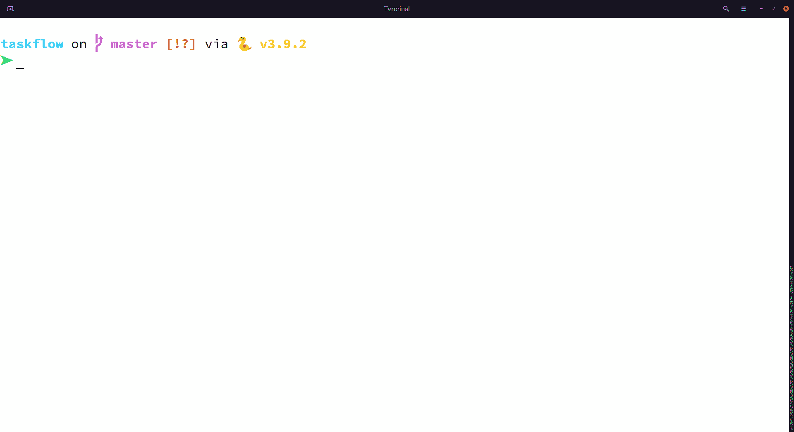

<p align="center">
    
</p>

# Taskflow: Share system resources without breaking a sweat


Taskflow is a UNIX utility that allows users to schedule arbitrary tasks to run when the system has enough resources available.

- [Why Taskflow](#why-taskflow)
- [Installation](#installation)
- [Usage](#usage)
- [Architecture](#architecture)
- [Contribution](#contribution)

## Why Taskflow?
Taskflow is best explained with an example. Let's say 3 users, Alice, Bob and Chuck are sharing the same workstation. They all need to run tasks that uses the workstation GPU (eg. training AI models). Alice runs her task first, which takes up the entire GPU memory. Now Bob and Chuck have to wait for Alice's task to finish before they can run theirs, checking the workstation every now and then to see if it's their turn. Taskflow can instead do the waiting for them by monitoring GPU usage and run their tasks when enough resources is available.

If you ever find yourself in Bob and Chuck's situation, Taskflow may be able to help you :)

I wrote Taskflow because I found myself constantly checking the lab workstation to run my GPU tasks. Taskflow is dead simple. It delays the execution of whatever command passed to it until it's appropriate to start. It features a simple scheduler so multiple tasks can be queued up at the same time. If you want something to run and there's no resource for it yet, just schedule it with Taskflow!

Taskflow is NOT a distributed task runner. There is no virtualization layer, tasks are executed in the same shell with the same environment. This means you can put `taskflow run` before any command or workflow you currently have, no change required.

## Installation
### Ubuntu
Debian packages are available for Ubuntu 18.04 and above

```bash
wget https://github.com/lanPN85/taskflow/releases/download/0.3.0/taskflow_0.3.0_amd64.deb
sudo dpkg -i taskflow_0.3.0_amd64.deb
sudo systemctl enable --now taskflowd
```

### Arch Linux
An AUR repository is available for Arch Linux users: https://aur.archlinux.org/packages/taskflow-git/

```bash
git clone https://aur.archlinux.org/taskflow-git.git
cd taskflow-git
makepkg -si
```

After installing, you will need to enable the `taskflowd` service for Taskflow to work properly:
```bash
sudo systemctl enable --now taskflowd
```

### Building from source
If you are using an unsupported distro or CPU architecture, see the building from source [instructions](docs/SOURCE_BUILD.md).

## Usage
### Basic usage
<p align="center">
    
</p>

Once Taskflow is installed, schedule your tasks using `taskflow run`. Use CLI options to declare the amount of resources the task needs. Currently, RAM and GPU memory are supported resources.
```bash
# Run task using 5GB RAM
taskflow run -m 5G my-command --option X Y

# Run task using 10GB memory on GPU 0
taskflow run --gpu 0:10G my-command --option X Y
```

All environment settings in the shell (eg. virtualenv, conda, etc...) are preserved when using Taskflow.

### View current tasks
You can view tasks managed by Taskflow using `taskflow ps`

### Detailed task info
Detailed info for a specific task can be viewed using `taskflow show <task-id>`

### Configuration
Taskflow can be configured by editing `/etc/taskflow/settings.yml`. The Taskflow daemon should be restarted for changes to take effect. For systemd, the restart command would be `sudo systemctl restart taskflowd`.

### Usage notes
Taskflow does not check whether a task actually uses the resources it asks for, meaning you only need to specify a rough estimate of how much resource a task need to not fail.

After starting a task, Taskflow has a default timeout of 15 seconds before another task can be scheduled. This is to make sure the previous task has locked up all needed resource before starting the next one. You can change this value using the `-d` option of `taskflow run`.

Refer to `taskflow --help` for detailed documentation of available commands.

## Architecture
If you're curious about how Taskflow works, refer to [this file](docs/ARCHITECTURE.md).

## Contribution
To contribute to Taskflow development, refer to the [Contribution guide](docs/CONTRIBUTING.md).
